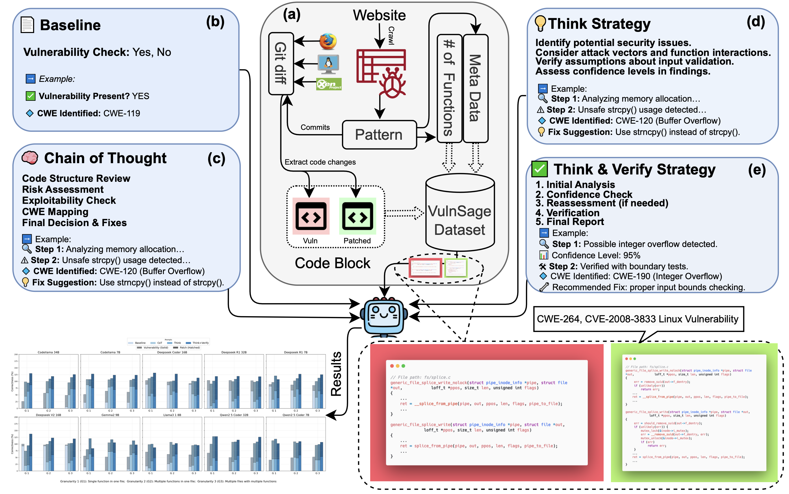

# VulnSage



VulnSage is a comprehensive evaluation framework and dataset for benchmarking Large Language Models (LLMs) on zero-shot software vulnerability detection (SVD) in real-world code. The framework assesses LLMs' capability to detect vulnerabilities and verify patches across multiple granularity levels and diverse vulnerability types.

## Overview

Automating software vulnerability detection remains a critical challenge in security-critical software systems. While Large Language Models (LLMs) have shown promising capabilities in code understanding, existing evaluation methodologies often lack the context-aware robustness necessary to assess their performance on real-world vulnerabilities.

VulnSage addresses this gap by providing:

- A **curated dataset** of 593 vulnerabilities across 52 CWE categories from real-world open-source projects
- A **multi-granular analysis** framework supporting function, file, and inter-function level evaluations
- **Four diverse zero-shot prompting strategies** designed to examine LLMs' reasoning capabilities
- A **noise quantification** methodology to ensure dataset reliability and evaluate LLM robustness

## Dataset

The VulnSage dataset includes 593 real-world vulnerabilities from large-scale open-source system software projects like the Linux Kernel, Mozilla, Gecko-dev, and Xen. Key dataset characteristics:

- 593 total vulnerabilities across 491 unique CVEs
- 52 unique CWE categories
- Year range: 2002-2019
- Average of 2.71 files and 18.42 functions changed per vulnerability
- Average of 296.79 lines in vulnerable code and 304.92 lines in patched code

### Granularity Distribution
- Single function (G1): 27 vulnerabilities
- Multiple functions, single file (G2): 244 vulnerabilities
- Multiple files & functions (G3): 322 vulnerabilities

## Prompting Strategies

VulnSage implements four zero-shot prompting strategies to evaluate different aspects of LLM reasoning:

1. **Baseline**: A direct approach using binary (YES/NO) classification without requiring explanations
2. **Chain of Thought (CoT)**: Structured reasoning through a six-step analytical process
3. **Think**: Explicit documentation of reasoning with defined sections for analysis and vulnerability assessment
4. **Think & Verify**: Two-phase verification process including confidence scoring and severity assessment


*Performance across different CWE types for each prompting strategy*

## Key Findings

- **Structured reasoning improves performance**: Think & Verify strategy reduces ambiguous responses from 20.3% to 9.1% while increasing accuracy
- **Code-specialized models excel**: Models specifically trained on code consistently outperform general-purpose alternatives
- **Performance varies by vulnerability type**: No single approach universally excels across all security contexts
- **Granularity impacts detection**: Multi-function and multi-file contexts improve vulnerability detection but make patch verification more challenging


*Impact of code granularity on LLM performance across different prompting strategies*

## Project Structure
```
project/
├── generate/              # Generated files directory
├── requirements.txt       # Project dependencies
├── scripts/               # Execution scripts
│   ├── run_analysis.py    # Main script for running vulnerability analysis
│   └── monitor_progress.py # Script for monitoring analysis progress
├── src/                   # Source code
│   ├── config.py          # Configuration settings
│   ├── database.py        # Database operations
│   ├── llm_interaction.py # LLM API interaction
│   ├── models.py          # Data models
│   ├── prompts/           # Prompt templates for different strategies
│   └── utils/             # Utility functions
├── tests/                 # Test files
└── vulnerability_dataset/ # Dataset processing and management
```

## Setup

1. Clone the repository:
```bash
git clone [repository-url]
cd project
```

2. Set up a virtual environment:
```bash
python -m venv venv
source venv/bin/activate  # For Linux/Unix
# or
.\venv\Scripts\activate  # For Windows
```

3. Install dependencies:
```bash
pip install -r requirements.txt
```

4. Ensure Ollama is installed and running:
```bash
# Check if Ollama is running
curl http://localhost:11434/api/generate
```

## Running the Code

1. **Normal Execution**:
```bash
python scripts/run_analysis.py
```

2. **Background Execution** (Linux/Unix):
```bash
# Using nohup
nohup python scripts/run_analysis.py > output.log 2>&1 &
tail -f output.log  # Check logs
```

3. **Monitoring Progress**:
```bash
python scripts/monitor_progress.py
```

## Database Structure

The system creates a new table for each model with the following structure:
- `COMMIT_HASH`: Unique identifier for each commit
- Results for each strategy (BASELINE, COT, THINK, THINK_VERIFY)
- Both vulnerable and patched code analysis results
- Reasoning columns for strategies that provide explanations

## Prompting Strategies

VulnSage implements four different prompting strategies:

1. **Baseline**: Simple YES/NO vulnerability detection
2. **Chain of Thought (CoT)**: Structured reasoning before making a decision
3. **Think**: In-depth analysis with step-by-step reasoning
4. **Think & Verify**: Two-stage reasoning with verification step

## Features

- **Multiple Prompting Strategies**: Compare effectiveness of different prompting approaches
- **Batch Processing**: Efficient processing of multiple code samples
- **Automatic Model Management**: Handles model installation and verification
- **Progress Tracking**: Resume capability for interrupted runs
- **Multi-threaded Processing**: Parallel processing for improved performance
- **Graceful Shutdown**: Properly saves state when interrupted
- **Comprehensive Logging**: Detailed logs for debugging and analysis

## Requirements

- Python 3.8+
- Ollama
- SQLite3
- Required Python packages:
  - pandas, numpy, matplotlib, seaborn
  - requests, transformers, torch
  - tqdm, colorlog
  - dspy (for prompt optimization)

## License

- **Code**: This repository's code is licensed under the [MIT License](https://opensource.org/licenses/MIT). You are free to use, modify, and distribute the code with attribution.

- **Dataset**: The dataset provided in `vulnerability_dataset/` is licensed under the [Creative Commons Attribution 4.0 International License (CC BY 4.0)](https://creativecommons.org/licenses/by/4.0/). You are free to share and adapt it, provided that appropriate credit is given.

## Citation

If you use this repository or dataset in your work, please cite the following paper:

```bibtex
@article{zibaeirad2025reasoning,
  title={Reasoning with LLMs for Zero-Shot Vulnerability Detection},
  author={Zibaeirad, Arastoo and Vieira, Marco},
  journal={arXiv preprint arXiv:2503.17885},
  year={2025}
}
